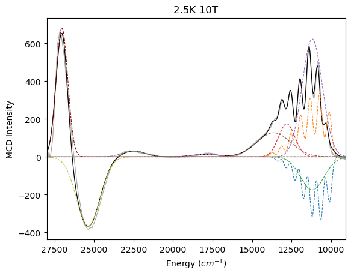

# Multispec Fitting Software

## Overview
Python designed for simultaneous fitting of multiple spectra, particularly useful for analyzing datasets with shared spectral features across changing conditions, such as Variable Temperature, Variable Field (VTVH) Magnetic Circular Dichroism (MCD) spectroscopy. Uses standard python packages (Scipy, Numpy, Matplotlib)

## Key Features & Physics Implemented
* **Simultaneous Global Fitting:** Fit multiple spectra simultaneously, tying parameters (band shape) across datasets while allowing amplitudes to float independently.
* **Gaussian Deconvolution:** Robust fitting of Gaussian lineshapes.
* **Amplitude and Sign Constraints:** Set specific boundaries on parameters, including opposite-signed amplitudes.
* **Vibronic Progressions:** Built-in support for modeling vibronic coupling using the Huang-Rhys factor and Poisson distributions, automatically calculating vibrational spacing.
* **Custom Parameter Constraints:** Define explicit mathematical relationships between different spectral bands directly in input file.
* **Temperature Dependent Peak Width Broadening** Constrained modeling of peak width broadening across temperature gradients.
* **Differential Evolution Optimization Algorithm** Option to use least-squared (default) or differential evolution (DE). Care should be taken with DE to set proper bounds.

## Example Single Spectra from VTVH fit
<p align="center">
  
</p>
*Fitted example using VTVH MCD data [1]*

## Installation

Clone the repository and install the required dependencies:

```bash
git clone git@github.com:drice987/multispec_fitting.git
cd multispec_fitting
pip install -r requirements.txt
```

## Quick Start
The software is executed directly from command line and relies on a single .toml config file to define the dataset, initial guesses, and constraints.
1. **Configure the fit:** Edit the input file (e.g., example/N2Q_t_indep_width.toml) to define temperatures, magnetic fields, and spectral band parameters.
2. **Run the fit** Execute the script in terminal:
```bash
python multispec_fitting.py python example/N2Q_t-indep_width.toml
```

## Outputs:
Upon successful global fit, the script will generate:
* `output_parameters.csv`: The optimized centers, widths, and vibronic parameters.
* `output_amplitudes.csv`: The intensity amplitudes for every spectra combination.
* `fitted_results.toml`: A new configuration file containing the optimized parameters.
* `fit_results.png`: A grid plot visuallying overlaying total fits and individual bands for each spectra.

## References
1. Derek B. Rice et al., *Sci. Adv.* **10**, eado1603(2024). DOI:10.1126/sciadv.ado1603

## ToDo
* **Add** Magnetization curve fits
* **Add** Pseudo-Voigt class
